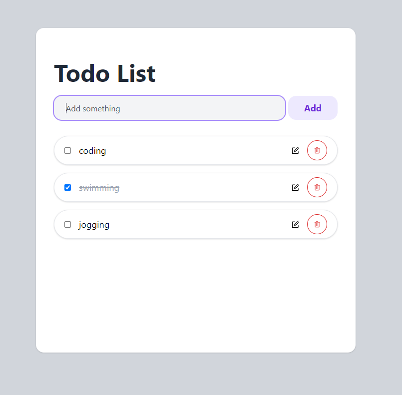

# ToDo-List

ToDo list is a simple Web application to save your daily task. I am using a server-client architecture and this is the server side written in Ruby on Rails.

## Features

* Add new task
* Edit task
* Mark task as completed or uncompleted
* Delete task

## Technologies used:

* HTML
* CSS
* [React](https://github.com/Jcheahh/TodoList)
* Ruby on Rails

## Screenshot

